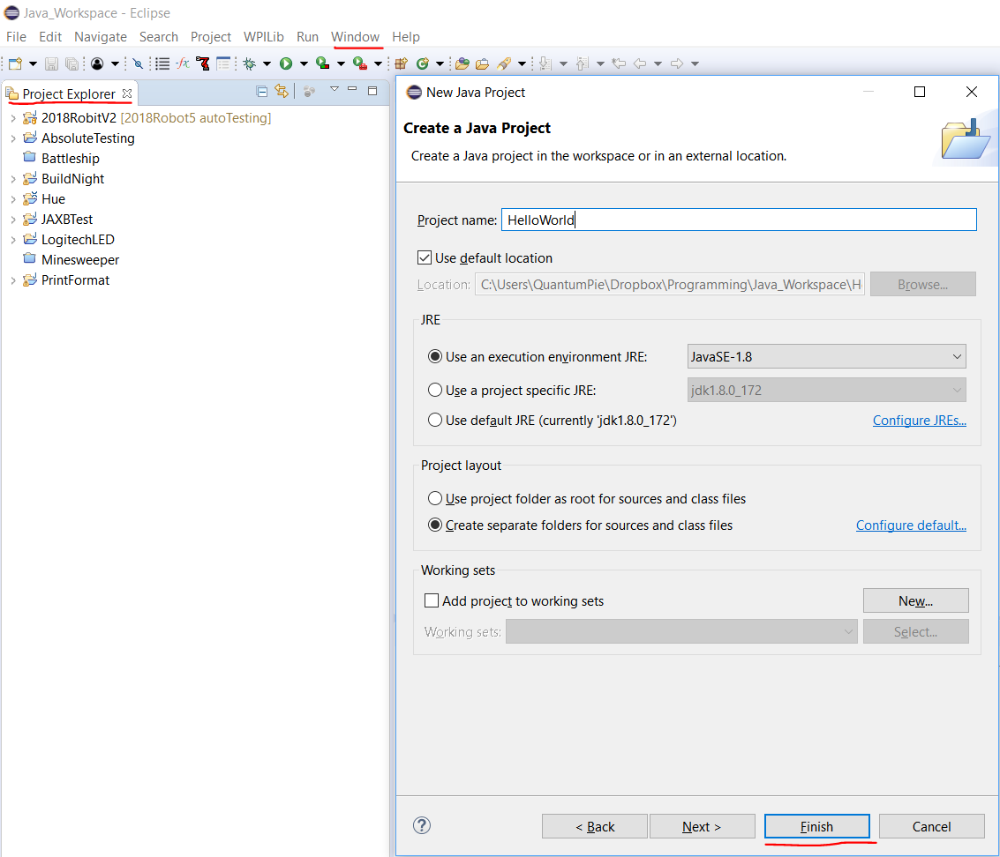
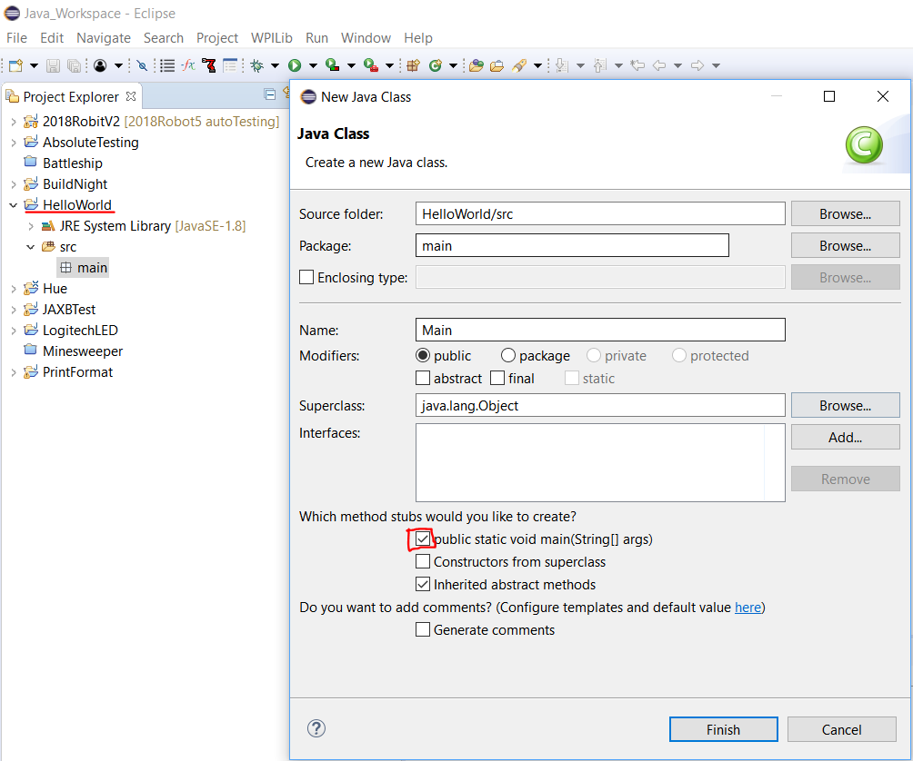

# Creating a Java Project
1. Open eclipse and make sure you see the Project Explorer tab. It is generally on the left side of the screen.
    - If you do not see it, go to Window->Show View->Project Explorer
2. Right click the white space in the tab and click either New->Other or Ctrl+N
3. Search for "Java Project" and select it.
4. In the New Java Project window, fill in a name under "Project name" and click "Finish".

5. For the newly created project, click the dropdown arrow and you will see JRE System Library and src. Right click src and select New->Package. Give the package a name and click "Finish".
    * Generally, package names should be all lowercase and contain no spaces and symbols.
6. Right click the newly created package and select New->Class. Select the "public static void main(String[] args)" checkbox and name the class. Since this is the class containing the main method, it is generally called Main.

7. Open the newly created class and you are ready to code!

# Creating a Robot Project