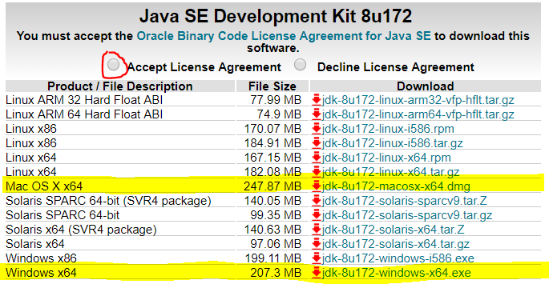

# Installing the JDK
1. Navigate to Oracle's [download](http://www.oracle.com/technetwork/java/javase/downloads/jdk8-downloads-2133151.html) page for JDK 8. At the time of writting this guide, JDK 10 is the most recent; however, WPI only supports JDK 8.
2. Accept the license agreement and download the correct x64 bit version for your operating system. 
3. Once the download is complete, run the installer. Make sure to leave the install directory as its default.
4. Once the installation finishes, restart your computer.
5. To verify that Java installed correctly, open CMD if you are on Windows or Terminal if you are on macOS. If you type "java -version" and "javac -version", and do not get an error, you are done! Please note that the final three digits do not need to match the output of the image 

# Installing Eclipse
1. Navigate to Eclipse's [download](http://www.eclipse.org/downloads/) page and click "Download 64bit" under the "Get Eclipse <version\>" heading.
2. Run the installer. Once it loads, select "Eclipse IDE for Java Developers" and then click the install button.

# Installing WPI
1. In Eclipse, click Help -> Install new software.
2. In the new Window (Install) that opens, click "Add...".
3. In the new Window (Add Repository), fill "name" with "WPI", and "location" with "http://first.wpi.edu/FRC/roborio/release/eclipse/".
4. Click "Ok"

